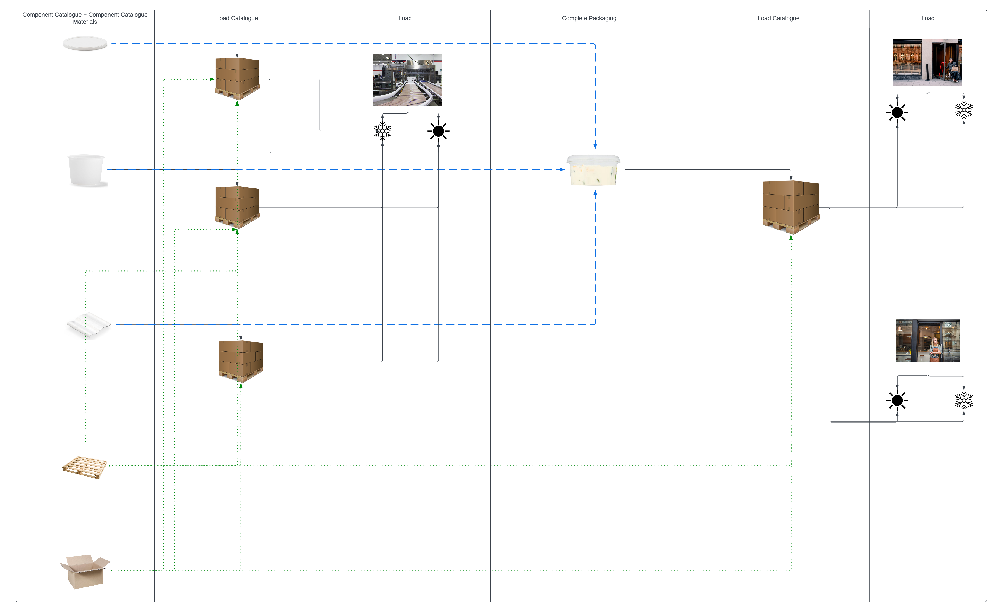

# Data Flow

Below is an example of the data flow for a dip being sold at a convenient store. To make the dip packaging, a packaging manufacturer will create a lid, film wrap, and tub (as seen in the left-most column, 'Component Catalogue + Component Catalogue Materials'). The packaging manufacturer will then use boxes to contain the lids, film wraps, and tubs. These boxes will then be sent to a packer filler to place the dip inside the tub, seal the tub with the film wrap, and place the lid over the film. From there, the packer filler will pack all the completely put together packaging and send it to the store for selling to a consumer.

To prevent the situation where data is entered multiple times, we introduce the concept of catalogues for components and loads. Catalogues store information that is shared and can be applied across multiple situations. For instance, the packaging for dip can apply to multiple brands, or different kinds of dips owned by a single brand. Additionally, the complete packaging is placed into loads and sent to specific stores and the information contained can be valid for specific time periods (to report how much on-the-market packaging is active during a specific time period). Instead of re-entering the data, simply use the unique identifiers from the catalogues to pass on the information.