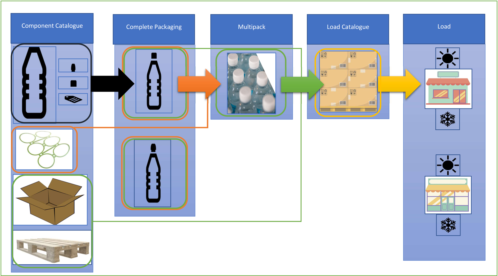

# Data Flow

Here, we show two examples of how data could flow using the open standard. This tells the story of how water bottles are created with a packaging manufacturer, how that packaging manufacturer sends their packaging to a packer/filler (Figure 1), and then how that packer/filler will put packaging together, filled with a product and then send them to a retailer (Figure 2). 

*Figure 1: From a packaging manufacturer to a packer/filler*

Above in Figure 1, we show the creation of water bottle components. After creating the water bottle components (the plastic bottle, two different types of lids, and a label), a packaging manufacturer would then use boxes (in this diagram it is one box size with the same materials) and a pallet to send their water bottle components to a packer/filler. The water bottle components, placed in the boxes on a pallet would create a load catalogue. This load catalogue would then be used to send to a specific packer/filler during a specific time period. The use of the component catalogue and load catalogue simplifies data entry by pulling data that has already been entered. Only the load would need to be updated based on reporting periods to estimate how many times a specific packer/filler recieved the load catalogue.

Another packaging manufacturer would then separately create the plastic rings and use boxes and a pallet that they consistently send to the specific packer/filler. They would also update how many times during a certain time period that they sent these plastic rings to the (single) packer/filler. According to this image, these plastic rings use the same boxes and pallet (sizes and materials) to create the load catalogue for sending the packaging items to the packer/filler. As with the water bottle packaging manufacturer, the load would be updated based on reporting periods to gain an estimate of how much plastic rings are being sent to an area.

*Figure 2: From a packer/filler to a retailer*

Instead of re-entering data, a packer/filler would pull the data from the packaging manufacturer for the water bottle components. Using the component catalogue, the packer/filler could create two different types of water bottles (with the two different kinds of lids). The packer/filler uses the components to create the two different complete packaging, sealed bottles with lids, which is filled with the product (in this case, water). In addition to creating single purchase water bottle items, the packer/filler can use the same created water bottles, along with the plastic ring to create a multipack. The two different types of individual use bottles along with the multipack can be combined onto a mixed pallet with boxes to create a load catalogue. As with the packaging manufacturer, the packer/filler can use the commonly created load catalogue items to send to multiple retail stores. They would then update how many times they sent the load to the retailer during certain reporting periods. 