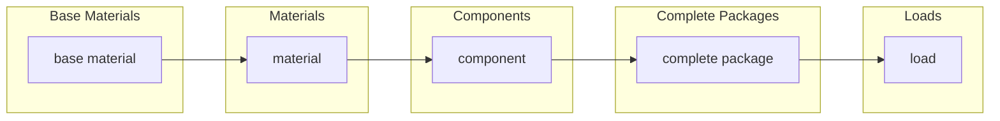
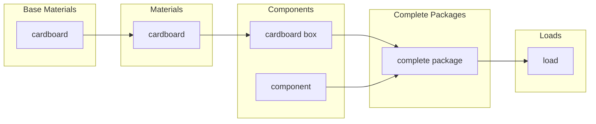
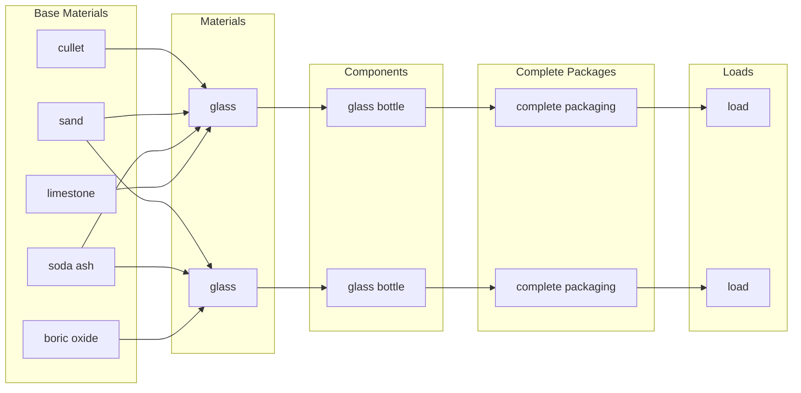
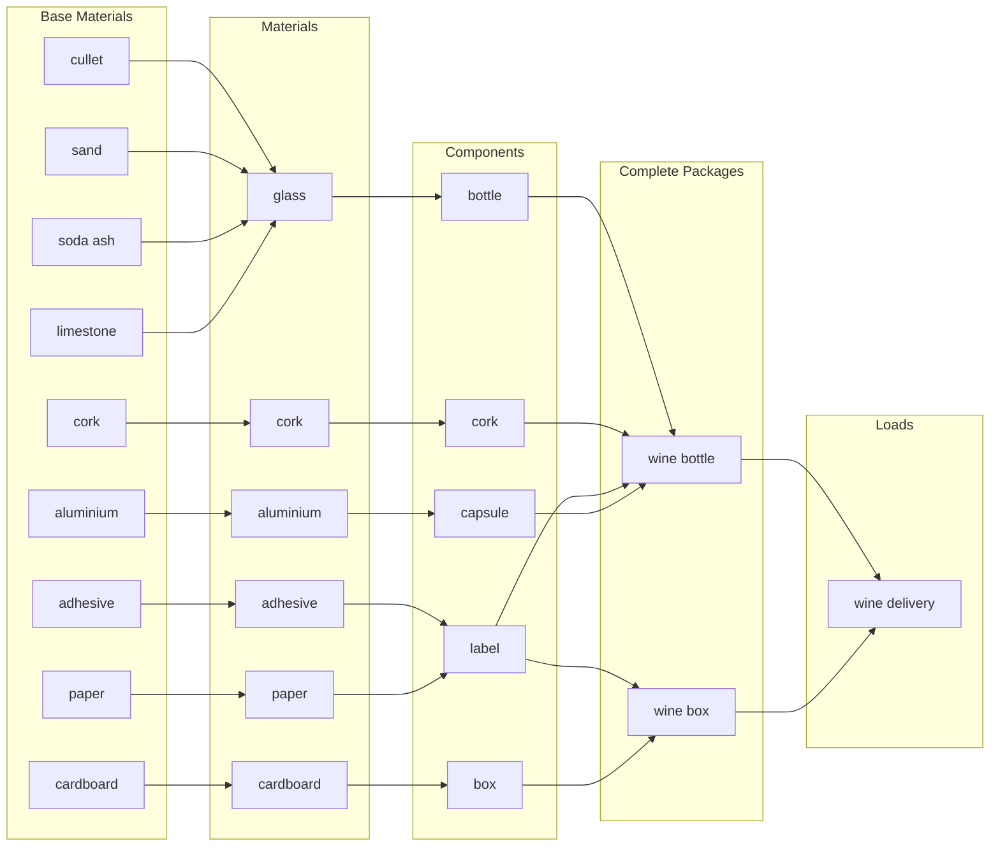

# Data Flow
Below are some worked examples of how different items can be structured, and how Open 3P can be used to different granulities of data.

## The flow

## Cardboard is cardboard is cardboard
At it's most basic Open 3P allows the minimal amount of infomation to be passed along.  During stakeholder engagement individuals and organisations suggested that some materials were always just the same (cardboard being one such material). In the example below cardboard is a [base material](../3_Data_Specification/3_1_Base_Materials.md) and a [material](../3_Data_Specification/3_2_Materials.md) and then a [component](../3_Data_Specification/3_3_Components.md).

## Glass is glass, except when it is not
Another example provided during stakeholder engagement is when a material is "always" the same, expect when it is not.

As you can see above, the same sand and soda ash are used to make the two glass materials, however the other base materials differ creating different types of glass (soda-lime glass and borosilicate glass). This information can be passed through the value chain, providing additional insights for stakeholders, clients and customers.

## Creating a load

## Complexity

The Open 3P standards allows additional complexity when combining schema. Each schema allows items form the schema before it aswell as itself.

Here, we show two examples of how data could flow using the open standard. This tells the story of how water bottles are created with a packaging manufacturer, how that packaging manufacturer sends their packaging to a packer/filler (Figure 1), and then how that packer/filler will put packaging together, filled with a product and then send them to a retailer (Figure 2). In both figures: 
- black represents the components items used to create complete packaging
- orange represents the complete packaging items used to create multipacks
- green represents the components, multipack, or complete packaging items used to create the load catalogue item
- yellow represents the load catalogue item made to create a load

*Figure 1: From a packaging manufacturer to a packer/filler*

Above in Figure 1, we show the creation of water bottle components. After creating the water bottle components (the plastic bottle, two different types of lids, and a label), a packaging manufacturer would then use boxes (in this diagram it is one box size with the same materials) and a pallet to send their water bottle components to a packer/filler. The water bottle components, placed in the boxes on a pallet would create a load catalogue. This load catalogue would then be used to send to a specific packer/filler during a specific time period. The use of components and the load catalogue simplifies data entry by pulling data that has already been entered. Only the load would need to be updated based on reporting periods to estimate how many times a specific packer/filler recieved the load catalogue.

Another packaging manufacturer would then separately create the plastic rings and use boxes and a pallet that they consistently send to the specific packer/filler. They would also update how many times during a certain time period that they sent these plastic rings to the (single) packer/filler. According to this image, these plastic rings use the same boxes and pallet (sizes and materials) to create the load catalogue for sending the packaging items to the packer/filler. As with the water bottle packaging manufacturer, the load would be updated based on reporting periods to gain an estimate of how much plastic rings are being sent to an area.

*Figure 2: From a packer/filler to a retailer*

Instead of re-entering data, a packer/filler would pull the data from the packaging manufacturer for the water bottle components. Using components, the packer/filler could create two different types of water bottles (with the two different kinds of lids). The packer/filler uses the components to create the two different complete packaging, sealed bottles with lids, which is filled with the product (in this case, water). Notice that even though the plastic ring is alone in complete packaging. The reason for this is to fill in data related to this component, even though alone. For instance, the level of packaging (primary, secondary, shipment, transit) relies on how the complete packaging is filled and used, which is contained in the complete packaging csv. 

In addition to creating single purchase water bottle items, the packer/filler can use the same created water bottles, along with the plastic ring to create a multipack. Notice how the first type of lid is used solely for creating a multipack, and the second type of lid is used to create an individual unit. The individual use bottles along with the multipack can be combined onto a mixed pallet with boxes to create a load catalogue. As with the packaging manufacturer, the packer/filler can use the commonly created load catalogue items to send to multiple retail stores. They would then update how many times they sent the load to the retailer during certain reporting periods. 