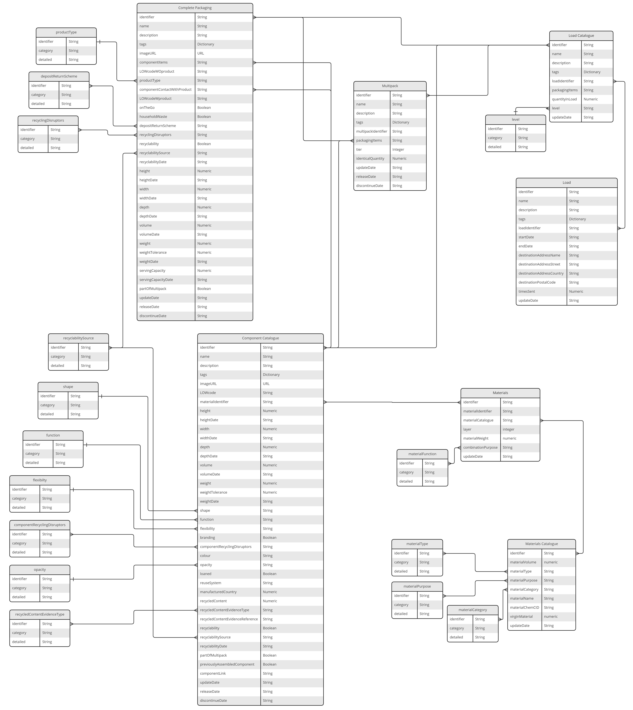

# Data Schema

<!-- ``` mermaid
erDiagram
  MATERIALS_CATALOGUE }o--o{ MATERIAL : within
  MATERIAL }o--o{ COMPONENT_CATALOGUE : within
  COMPONENT_CATALOGUE }o--o{ COMPLETE_PACKAGING : within
  COMPLETE_PACKAGING }o..o{ MULTIPACK : within
  COMPONENT_CATALOGUE }o..o{ MULTIPACK : within
  MULTIPACK }o..o{ LOAD_CATALOGUE : within
  COMPLETE_PACKAGING }o--o{ LOAD_CATALOGUE : within
  COMPONENT_CATALOGUE }o--o{ LOAD_CATALOGUE : within
  LOAD_CATALOGUE }o--o{ LOAD : within
``` -->

<figure markdown>
[](https://opendatamanchester.github.io/PPP/img/schema-v1.1-2022-12-20.jpg){target=_blank}
  <figcaption>Data schema</figcaption>
</figure>