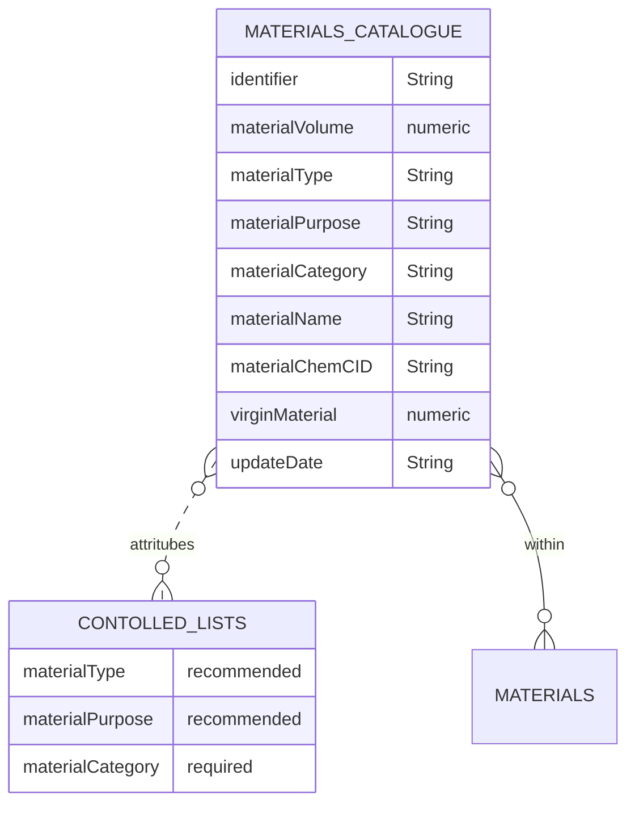

# Materials Catalogue

The materials catalogue schema contains information regarding the base material. These are then combined together within the materials table.

## Table
|Column|<div style="width:90px">Status</div>|Format|Notes|
|:-|:-|:-|:-|
|identifier|`required`|String|A globally unique identifier. See identifiers section for information on how to construct this identifier|
|materialVolume|`recommended`|numeric|The amount of material used given in `ml` (See 'Guide for how to take measurements' below).|
|materialType|`recommended`|String|Is the material 'synthetic' or 'biobased'? Use the identifier of the material type that this row relates to. The entry here should be drawn from the material type controlled list.|
|materialPurpose|`recommended`|String|Why is this material being used? Use the identifier of the material purpose that this row relates to. The entry here should be drawn from the material purpose controlled list.|
|materialCategory|`required`|String|The category this material row relates to. The entry here should be drawn from the material category controlled list.|
|materialName|`required`|String|The name of the material this row relates to. `e.g., Polypropylene or Titanium Dioxide`|
|materialChemCID|`recommended`|String|The PubChem CID for the exact material used. The PubChem CID is PubChem's compound identifier, which is a non-zero integer for a unique chemical structure. PubChem CID can be found using their [search](https://pubchem.ncbi.nlm.nih.gov/){target=_blank}. If for some reason the PubChem CID cannot be located, consider contributing to PubChem and create the compound identifier. However, if this cannot be done, please enter `Unknown`.|
|virginMaterial|`recommended`|numeric|The maximum allowable percent of the material that was newly created for the component.|
|updateDate|`required`|String|The date that the material was provided/last updated. Use the format `dd/mm/yyyy`.|

## Diagram



<!-- <figure markdown>
[{ width="450" }](https://opendatamanchester.github.io/PPP/img/material_catalogue-v1.0.0-22-12-20.png){target=_blank}
  <figcaption>Data schema</figcaption>
</figure> -->

## Template

Materials should be provided as a separate csv file, in tidy format. This means that each row of the csv file should be one material that is combined in the materials csv to create combinations. An example is provided.

The specification of this csv file is as follows:

[Material_Catalogue_Template.csv](https://www.opendatamanchester.org.uk/wp-content/uploads/2023/01/7_1_7_Materials_Catalogue_Template.csv){target=_blank}

## Example

=== "JSON"

    ``` json linenums="1"
    {
      "identifier": "A4BAE07C-1847-CD8E-C933-6FD30478423B",
      "materialVolume": "1000",
      "materialType": {
        "identifier":"material-component-catalogue-type-0002",
        "category":"synthetic",
        "detailed":"derived from crude oil, natural gas or coal."
      },
      "materialPurpose": {
        "identifier":"material-component-catalogue-purpose-0015",
        "category":"structure",
        "detailed":""
      },
      "materialCategory": {
        "identifier":"material-component-catalogue-category-0007",
        "category":"plastic",
        "detailed":""
      },
      "materialName": "PET",
      "materialChemCID": "223961227",
      "virginMaterial": "20",
      "updateDate": "01/08/2022",
    }
    ```
=== "CSV download"

    * [Material Catalogue example download](https://www.opendatamanchester.org.uk/wp-content/uploads/2023/01/7_1_7_Materials_Catalogue_Example.csv){target=_blank}


## Guide for how to take measurements

### Units

All measurements should be given using the metric system.

- Volume: millilitre (ml)

Numbers should be entered with a decimal place. Use the decimal / full stop / period character as a separator. Do not exceed 3 decimal places. When rounding, use convential rounding methods: for 5 and above round up, 4 and below round down. For example: volume = 0.67952 rounded to 0.68. 

**Important**: When converting between systems of measurement, perform the conversion first and then apply the convential rounding. This will give more accuracy and consistency.

