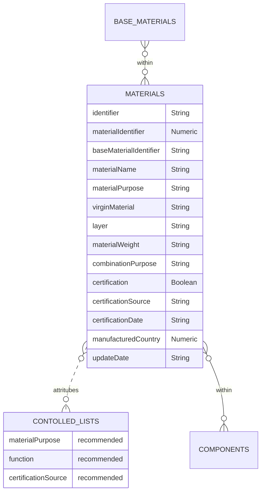

# Materials

The materials schema contains information regarding the materials that are used within components. These maybe a single material from the base materials catalogue, a combination of base materials and/or a material from the materials schema itself.

## Table
|Column|<div style="width:90px">Status</div>|Format|Notes|
|:-|:-|:-|:-|
|identifier|`required`|String|A globally unique identifier. See identifiers section for information on how to construct this identifier|
|materialIdentifier|`required`|String|The unique identifier of the created material. See identifiers section for information on how to construct this identifier.|
|baseMaterialIdentifier|`required`|String|The unique identifier of the material that this row relates to. There must be an equivalent record in the `base_Materials` data|
|materialName|`required`|String|The name of the material this row relates to. `e.g., Aluminium 3000 Series or Borosilicate glass`|
|materialPurpose|`recommended`|String|Why is this material being used? Use the identifier of the material purpose that this row relates to. The entry here should be drawn from the [Material Purpose Controlled List](https://github.com/OpenDataManchester/PPP/blob/main/docs/5_Controlled_Lists/5_2_2_Material_Purpose.csv){target=_blank}.|
|virginMaterial|`recommended`|Numeric|The maximum allowable percent of the material that was newly created for the component.|
|layer|`recommended`|Numeric|The layer associated with the component. The inner most layer (the layer closest to the product) denoted as 1, and the outermost layer is the biggest number.|
|materialWeight|`recommended`|Numeric|The percentage of the total materials making-up the component. For every unique componentCatalogue, weightMaterial should add to 100%.|
|combinationPurpose|`recommended`|String|Why is this material being used? Use the identifier of the function that this row relates to. The entry here should be drawn from the [Function Controlled List](https://github.com/OpenDataManchester/PPP/blob/main/docs/5_Controlled_Lists/5_1_2_Function.csv){target=_blank}.|
|certification|`recommended`|Boolean|Does the material have a certificate (e.g. FSC, REACH, FSA etc.)?|
|certificationSource|`recommended`|String|What source provided the certificate? The entry should be the [Certification Source Controlled List](https://github.com/OpenDataManchester/PPP/blob/main/docs/5_Controlled_Lists/5_2_4_Certification_Source.csv){target=_blank} identifier.|
|certificationDate|`recommended`|String|The date that the certificate was provided/last updated. Use the format `dd/mm/yyyy`.|
|manufacturedCountry|`recommended`|Numeric|The country the component was manufactured in. Use the country numeric [ISO codes](https://www.iban.com/country-codes){target=_blank} as described in the ISO 3166 international standard.|
|updateDate|`required`|String|The date that the material was provided/last updated. Use the format `dd/mm/yyyy`.|

## Diagram



<!-- <figure markdown>
[{ width="450" }](https://opendatamanchester.github.io/PPP/img/materials-v1.0-2022-12-20.png){target=_blank}
  <figcaption>Data schema</figcaption>
</figure> -->

## Template
Materials should be provided as a separate csv file, in tidy format. This means that each row of the csv file should be one material for a component. An example is provided.

The specification of this csv file is as follows:

[Materials_Template.csv](https://www.opendatamanchester.org.uk/wp-content/uploads/2023/01/7_1_2_Materials_Template.csv){target=_blank}

## Example

=== "JSON #1"

    ``` json linenums="1"
    --Food grade synthetic polyethylene terephthalate (PET) made in the UK. Only one base material.
    {
      "identifier": "DCEE1F88-A83B-5BBC-D2D9-6A862B344977",
      "materialIdentifier": "278EFE8A-720A-06C1-A411-CB94878AD3E2",
      "baseMaterialIdentifier": {
        "identifier": "A4BAE07C-1847-CD8E-C933-6FD30478423B",
        "name": "PET",
        },
      "materialName":"PET",
      "materialPurpose": {
        "identifier": "material-component-catalogue-purpose-0015",
        "category": "structure",
        },
      "virginMaterial": 0,
      "layer": "1",
      "materialWeight": "100",
      "combinationPurpose": "",
      "certification": "TRUE",
      "certificationSource": {
        "identifier": "certification-source-0002",
        "category": "FSA",
        "detailed": "The Food Standards Agency (FSA) is the independent government department working to protect public health and consumers’ wider interests in relation to food in England, Wales and Northern Ireland."
      },
      "certificationDate": "01/08/2022",
      "manufacturedCountry": {
        "Country": "United Kingdom of Great Britain and Northern Ireland (the)",
        "Numeric": 826
      },
      "updateDate": "01/08/2022",
    }
    ```
=== "JSON #2"

    ``` json linenums="1"
    --Soda-lime-silica glass made in the UK. Made from three base materials.
    {
      "identifier": "339bac2a-4dd0-49f3-977e-f3aa45f9b852",
      "materialIdentifier": "2823aa68-b2ed-47cf-8e03-4fa97a3efd9c",
      "baseMaterialIdentifier": {
        "identifier": "09b0d75d-ddb2-43af-8eaa-f8ab03cd6702",
        "name": "Silicon dioxide",
        },
      "materialName": "Soda-lime-silica glass",
      "materialPurpose": {
        "identifier": "material-component-catalogue-purpose-0015",
        "category": "structure",
        },
      "virginMaterial": 0,
      "layer": "",
      "materialWeight": 74,
      "combinationPurpose": "",
      "certification": "FALSE",
      "certificationSource": """",
      "certificationDate": "",
      "manufacturedCountry": {
        "Country": "United Kingdom of Great Britain and Northern Ireland (the)",
        "Numeric": 826
      },
      "updateDate": "01/08/2022",
    },
    {
      "identifier": "ca7c6b8f-2c48-4578-be92-510898d2179d",
      "materialIdentifier": "2823aa68-b2ed-47cf-8e03-4fa97a3efd9c",
      "baseMaterialIdentifier": {
        "identifier": "d68c1342-00ef-41bb-9a1d-df8d3a43e73e",
        "name": "Sodium oxide",
        },
      "materialName": "Soda-lime-silica glass",
      "materialPurpose": {
        "identifier": "material-component-catalogue-purpose-0015",
        "category": "structure",
        },
      "virginMaterial": 0,
      "layer": "",
      "materialWeight": 13,
      "combinationPurpose": "",
      "certification": "FALSE",
      "certificationSource": """",
      "certificationDate": "",
      "manufacturedCountry": {
        "Country": "United Kingdom of Great Britain and Northern Ireland (the)",
        "Numeric": 826
      },
      "updateDate": "01/08/2022",
    },
    {
      "identifier": "128722d2-efca-492c-aa35-343d0275109c",
      "materialIdentifier": "2823aa68-b2ed-47cf-8e03-4fa97a3efd9c",
      "baseMaterialIdentifier": {
        "identifier": "51bfd8c3-1631-4ef4-bec2-04add7c1cb74",
        "name": "Calcium oxide",
        },
      "materialName": "Soda-lime-silica glass",
      "materialPurpose": {
        "identifier": "material-component-catalogue-purpose-0015",
        "category": "structure",
        },
      "virginMaterial": 0,
      "layer": "",
      "materialWeight": 10.5,
      "combinationPurpose": "",
      "certification": "FALSE",
      "certificationSource": """",
      "certificationDate": "",
      "manufacturedCountry": {
        "Country": "United Kingdom of Great Britain and Northern Ireland (the)",
        "Numeric": 826
      },
      "updateDate": "01/08/2022",
    },
    ```
=== "CSV download"

    * [Materials example download](https://www.opendatamanchester.org.uk/wp-content/uploads/2023/01/7_1_2_Materials_Example.csv){target=_blank}

## Guide for how to take measurements

### Units

All measurements should be given using the metric system.

- Weight: grams (g)

Numbers should be entered with a decimal place. Use the decimal / full stop / period character as a separator. Do not exceed 3 decimal places. When rounding, use convential rounding methods: for 5 and above round up, 4 and below round down. For example: volume = 0.67952 rounded to 0.68. 

**Important**: When converting between systems of measurement, perform the conversion first and then apply the convential rounding. This will give more accuracy and consistency.
