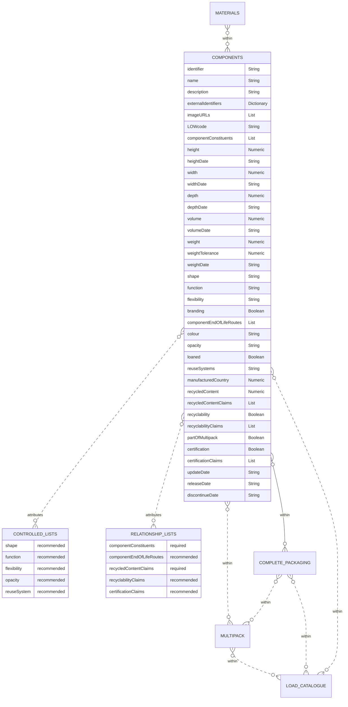

# Components

The components schema contains information regarding the individual components that are used to create complete packages. These maybe created from a single material or a combination of materials from the materials schema.

## Table
|Column|<div style="width:90px">Status</div>|Format|Notes|
|:-|:-|:-|:-|
|identifier|`required`|String|A globally unique identifier. See [identifiers](../4_Identifiers/4_1_Identifiers.md) section for information on how to construct this identifier|
|name|`recommended`|String|The name of this component.|
|description|`recommended`|String|A brief description of this component.|
|externalIdentifiers|`recommended`|Dictionary|A dictionary of identifiers that might be used to identify the component in other systems. For example: manufacturer's own internal identifier, bar codes or global trade item number (gtin). To provide external identifiers please follow this format. `{'externalIdentifierName1': 'identifier1', 'externalIdentifierName2': 'identifier2'}`|
|imageURLs|`recommended`|List|A list of URLs that links to a picture of the component. Please see the guidelines below on how to capture the image and name the URL.|
|LOWcode|`recommended`|String|The list of waste code for **only** the component, by itself. LOW code is synonymous with European Waste Catalogue Code (EWC). For example: an empty bottle would have a LOWcode of `15 01 02`. Please use [Dsposal](https://dsposal.uk/browse/ewc) or [legislation.gov](https://www.legislation.gov.uk/uksi/2005/895/schedule/1/made) to find the LOWcode. **Note**: The LOWcode can based on its combination with other components and the actual product contained in the completePackaging. Be sure to only include the component LOWcode. If you cannot find the code or are uncertain please enter `Uncertain`.|
|componentConstituents|`required`|List|The information regarding the consituents that are combined to create this component. The entries should be from the [Component Constituents Relationship List](../6_Relationship_Lists/6_002_Component_Constituents.md) identifier.|
|height|`recommended`|Numeric|The height of the component. Please see the guidelines below on how to properly measure and report the height.|
|heightDate|`recommended`|String|The date that the height was last verified/measured. Use the format `dd/mm/yyyy`.|
|width|`recommended`|Numeric|The width of the component. Please see the guidelines below on how to properly measure and report the width.|
|widthDate|`recommended`|String|The date that the width was last verified/measured. Use the format `dd/mm/yyyy`.|
|depth|`recommended`|Numeric|The depth of the component. Please see the guidelines below on how to properly measure and report the depth.|
|depthDate|`recommended`|String|The date that the depth was last verified/measured. Use the format `dd/mm/yyyy`.|
|volume|`recommended`|Numeric|The amount of space the component takes up. Note: this is related to the size of the component and is different to capacity. Using the height, width, and depth found using the measurement guidelines, calculate the component’s volume using: `height x width x depth`.|
|volumeDate|`recommended`|String|The date that the volume was last verified/measured. Use the format `dd/mm/yyyy`.|
|weight|`required`|Numeric|The weight of the component.|
|weightTolerance|`required`|Numeric|The threshold of weight that components can vary by. This is given as +/- x%.|
|weightToleranceType|`required`|String|Either `grams` or `percentage` based on the value provided in `weightTolerance`|
|weightDate|`recommended`|String|The date that the weight was last verified/measured. Use the format `dd/mm/yyyy`.|
|shape|`recommended`|String|What is the shape of the component? The entry should contain the [shape controlled list](../5_Controlled_Lists/5_006_Shape.md) identifier for the component.|
|function|`recommended`|String|What is the function of the component? The entry should contain the [function controlled list](../5_Controlled_Lists/5_004_Function.md) identifier for the component.|
|flexibility|`recommended`|String|Whether the component is considered flexible or rigid. The entry should be the [flexibility controlled list](../5_Controlled_Lists/5_007_Flexibility.md) identifier.|
|branding|`required`|Boolean|Does the component contain your own brand (logo, trademark, or any distinctive mark)? Answer as: `TRUE` for yes and `FALSE` for no.|
|componentEndOfLifeRoutes|`recommended`|List|The information regarding this component's proposed end of life routes. The entries should be the [component end of life routes](../6_Relationship_Lists/6_007_Component_End_of_Life_Routes.md) identifiers.|
|colour|`recommended`|String|The actual colour of the component at point of production using CMYK (Cyan-Magenta-Yellow-blacK) values. The format is specified according to cmyk(C%, M%, Y%, K%), where C, M, Y, and K are the percent values for the cyan, magenta, yellow, and black values of the color. For example: black is `cmyk(0%,0%,0%,100%)`. If there are multiple colours input `decorative`.|
|opacity|`recommended`|String|The transparency of the colours. The entry should be the [opacity controlled list](../5_Controlled_Lists/5_009_Opacity.md) identifier.|
|loaned|`required`|Boolean|Is the component hired or loaned out as reusable packaging? Answer as: `TRUE` for yes and `FALSE` for no.|
|reuseSystems|`recommended`|List|The system(s) that facilitates the reuse of the component  `e.g., Loop`. The entries should be the [reuse system controlled list](../5_Controlled_Lists/5_010_Reuse_System.md) identifier(s).|
|partOfMultipack|`required`|Boolean|Is the component part of a multipack? Answer as: `TRUE` for yes and `FALSE` for no.|
|recycledContent|`recommended`|Numeric|The minimum allowable percent of how much recycled content is included in the makeup of the component. t is ‘required’ for plastic packaging where for the purposes of this standard we refer to [UK's HM Revenue & Customs](https://www.gov.uk/guidance/work-out-which-packaging-is-subject-to-plastic-packaging-tax){target=_blank} definition of recycled content. "Recycled plastic is plastic that has been reprocessed from recovered material by using a chemical or manufacturing process. This is so it can be used either for its original purpose or for other purposes. This does not include organic recycling. Recovered material is pre-consumer plastic or post-consumer plastic that both: a) is no longer suitable to be used in the process from which it was generated and would otherwise have been used for energy recovery (for example, by incineration) or disposed of as waste (for example, by being sent to landfill); b) has been collected and recovered for use as a material input for a recycling or manufacturing process, instead of new primary material"|
|recycledContentClaims|`required`|List|The information regarding the recycled contents. The entries should be the [recycled content claims relationship list](../6_Relationship_Lists/6_009_Recycled_Content_Claims.md) indentifiers.|
|recyclability|`recommended`|Boolean|Is the component recyclable (as determined by a reputable source)? Answer as: `TRUE` for yes and `FALSE` for no.|
|recyclabilityClaims|`recommended`|List|The information regarding this recyclability claims. The entries should be the [recyclability claims relationship list](../6_Relationship_Lists/6_006_Recyclability_Claims.md) identifiers.|
|certification|`recommended`|Boolean|Does the component have a certificate (e.g. FSC, REACH, FSA etc.)? Answer as: `TRUE` for yes and `FALSE` for no.|
|certificationClaims|`recommended`|List|The information regarding the certifications. The entries should be the [certification claims relationship list](../6_Relationship_Lists/6_005_Certification_Claims.md) identifiers.|
|manufacturedCountry|`recommended`|Numeric|The country the component was manufactured in. Use the country numeric [ISO codes](https://www.iban.com/country-codes){target=_blank} as described in the ISO 3166 international standard.|
|updateDate|`required`|String|The date that the component was provided/last updated. Use the format `dd/mm/yyyy`.|
|releaseDate|`recommended`|String|The date that the component will be available to use. Use the format `dd/mm/yyyy`.|
|discontinueDate|`recommended`|String|The date that the component will no longer be available to use. Use the format `dd/mm/yyyy`.|

## Diagram



Components should be provided as a separate csv file. The specification of this csv file is as follows:

[Components Template](https://www.open3p.org/wp-content/uploads/2023/09/components20230922.csv){target=_blank}

## Example

=== "JSON"

    ``` json linenums="1"
    --Food grade PET pot made in Ireland
    {
        "identifier": "9F459508-E365-0B9F-E3BB-FF4A7AED481B",
        "name": "Thermoformed rPET tray",
        "description": "Clear PET tray for food products",
        "externalIdentifiers": {
            "internalId": "14",
            "GTIN": "00123456789012"
        },
        "imageURLs": [
        "http://standard.open3p.org/2.0/img/measurements/figure1.measuring.png"
        ],
        "LOWcode": "150102",
        "componentConstituents": [
            "DCEE1F88-A83B-5BBC-D2D9-6A862B344977"
        ],
        "height": 50,
        "heightDate": "01/08/2022",
        "width": 220,
        "widthDate": "01/08/2022",
        "depth": 170,
        "depthDate": "01/08/2022",
        "volume": 1870,
        "volumeDate": "01/08/2022",
        "weight": 23,
        "weightTolerance": 1.5,
        "weightToleranceType": "grams",
        "weightDate": "01/08/2022",
        "shape": "c-shape-0004",
        "function": "function-0041",
        "flexibility": "c-flexibility-0002",
        "branding": true,
        "componentEndOfLifeRoutes": [
            ""
        ],
        "colour": "cmyk(0%,0%,0%,10%)",
        "opacity": "c-opacity-0002",
        "loaned": false,
        "reuseSystems": [
            "c-reuse-system-0001"
        ],
        "partOfMultipack": false,
        "recycledContent": 0.3,
        "recycledContentClaims": [
            "23e8251a-4fe6-4b25-9966-b08acac9ba34"
        ],
        "recyclability": true,
        "recyclabilityClaims": [
            "b101889f-87e5-4c42-abb7-0df5fc3d1a26"
        ],
        "certification": true,
        "certificationClaims": [
            "eed87ac3-6e3e-45fb-af2c-dd0f64fdb597"
        ],
        "manufacturedCountry": 372,
        "updateDate": "01/08/2022",
        "releaseDate": "01/08/2022",
        "discontinueDate": ""
    }
    ```
=== "CSV download"

    * [Component Catalogue example download](https://www.opendatamanchester.org.uk/wp-content/uploads/2023/01/7_1_1_Component_Catalogue_Example.csv){target=_blank}

## Guide for how to take measurements

### Units

All measurements should be given using the metric system.

- Height: millimetre (mm)
- Width: millimetre (mm)
- Length: millimetre (mm)
- Volume: cubic metre (m3)
- Weight: grams (g)
- Weight Tolerance: percent (%)

Numbers should be entered with a decimal place. Use the decimal / full stop / period character as a separator. Do not exceed 3 decimal places. When rounding, use convential rounding methods: for 5 and above round up, 4 and below round down. For example: volume = 0.67952 rounded to 0.68. 

**Important**: When converting between systems of measurement, perform the conversion first and then apply the convential rounding. This will give more accuracy and consistency.

### Default Front of a component
Prior caputuring measurements, first determine the default front of the component, this is similar to [GS1](https://www.gs1.org/){target=_blank} (Note: GS1 rules are specified only for complete packaging and not components. Therefore, there are subtle differences to convert from taking a measurement for the complete packaging versus a component). In this standard, as with [GS1](https://www.gs1.org/standards/gs1-package-and-product-measurement-standard/current-standard#4-Consumer-(end-user)-trade-items+4-2-Determining-the-default-front){target=_blank}, the default front is the face with the largest surface area, where area is equal to the `width` times the `height`.

**Important**: Determining of default front provides a consistent, repeatable process to find measurements for a given component.

<center>{:height="40%" width="30%"}</center>
<center>_Figure 1: An example for finding the default front of a component. The default front is the face of the with the largest area (Area = `width` X `height`)_</center>

Some components have the same surface area, thus more than one possible front. These components can be presented both vertically and horizontally. If a component has more than one possible front, the highest side is considered to be the default front.

**Note**: Calculating the area for a rectangular component is simple. However, for non-rectangular components (for example, components with a cylindrical or irregular form), the method to calculate the area is:

- First break the component into multiple sides. Then, for:
    - a round component: do not use (=pi*r^2) to calculate the area. Instead, draw "two dimensional" rectangles around the round component's sides and then calculate the area for each side.
    - any other shape component: draw a "two dimensional" rectangle around the sides of the component, and then calculate the area for each side.
- The side with the maximum area then becomes the default front of that component.

<center>{:height="40%" width="50%"}</center>
<center>_Figure 2: An example for finding the default front of an irregular shaped component. After drawing rectangles around the component, the default front is the face of the with the largest surface area (Area = `width` X `height`)_</center>

### Measuring the height, width, and depth of a component
After the default front has been determined, as with [GS1](https://www.gs1.org/standards/gs1-package-and-product-measurement-standard/current-standard#4-Consumer-(end-user)-trade-items+4-3-Determining-the-height,-width-and-depth){target=_blank}, it is possible to determine the height, width, and depth of a component. 

1. For rectangular components: 
    - Height: from the base to the top
    - Width: from the left to the right
    - Depth: from the front to the back


<center>{:height="40%" width="30%"}</center>
<center>_Figure 3: Example of measuring the height, width, and depth for a rectangular component._</center>

**Note:** If there are two different measurements for the height, width, or depth, always report the maximum measurement.

<center>{:height="40%" width="30%"}</center>
<center>_Figure 4: Example of reporting the maximum width, when there are two different size widths. Here, the width reported would be 12 mm because it is larger than the 8 mm. Additionally, there are two different sized depths. Here, the 9 mm depth would be reported because it is larger than the 5 mm depth._</center>


2. For irregular shaped components:
Similar to finding the default front of an irregularly shaped component, draw a "three dimensional" rectangle around the component.
    - Height: from the base to the top
    - Width: from the left to the right
    - Depth: from the front to the back

3. For unformed, flexible components:
    - Take the measurements as if the component was fully formed and filled.

4. For standing components:
    - Height: from the flat surface to the top most point
    - Width: from the left-most point to the right-most point
    - Depth: from the default front to the farthest opposite surface

5. For components with leaning or irregular verticlas:
    - Height: from the flat surface to the top most point (parallel to the vertex)
    - Width: from the left most point to the right most point 
    - Depth: from the default front to the farthest opposite surface

6. For components that are cylindrical:
    - For cylindrical items two dimensions will be nominally equal. Which dimensions are equal is determined by the result of determination of the default front.


## Guide for component images
As with providing measurements, please first find the default front of the component. The image capturing process and naming convention is similar to [GS1](https://www.gs1.org/standards/gs1-product-image-specification-standard/current-standard#1-Introduction){target=_blank}. As with measurements, we altered the gs1 standard for capturing the component.

### Type of Image
For the purposes of this standard, we define the differences between photographic and rendered images. Note: both types are accepted but the naming convention will differ based on image type so that images have unique names and do not having naming conflicts.

- **Photographic image**: the result of the electronic or chemical capture of a likeness of a physical object with the use of a camera.
- **Rendered image**: the result of the creation of a digital likeness of a physical object with the use of a computer and software.

### Image Recommendations
- Provide coloured images. However, do not provide colour casts. Colour should be as rich, vibrant and eye-catching as possible
- Contrast and exposure should be balanced; avoid high contrast effects and "blown-out" highlights
- Images should not be overly sharpened
- Components should be centred in Margins to cover 95% on the canvas.
- Graphic rendering of a component should be realistic.
- Do not provide layers, guides or rulers in the images.
- Background layer should be white (RGB 255,255,255).
- Remove signatures, "finger printing" or visible watermarks. No compression artifacts. No interpolation ("resizing up").

### File size
- 900x900 to 2400x2400 pixels

### Component faces
After determining the default front, the possible faces, in relation to the default front, are:
1. Default Front
2. Left
3. Top
7. Back
8. Right
9. Bottom

### Naming convention for URL
Please follow this naming convention: 
- component identifier
- underscore `_`
- type of image (`photographic` or `rendered`)
- underscore `_`
- component face (`1`: Default front, `2`: Left, `3`: Top, `7`: Back, `8`: Right, `9`: Bottom)
- orientation (`C`: Centre, `L`: left, `R`: right, `N`: No plunge angle)

**Example**: An image for a component that is rendered with a default front facing image and centred orientation. `identifier123_rendered_1C.jpg`


