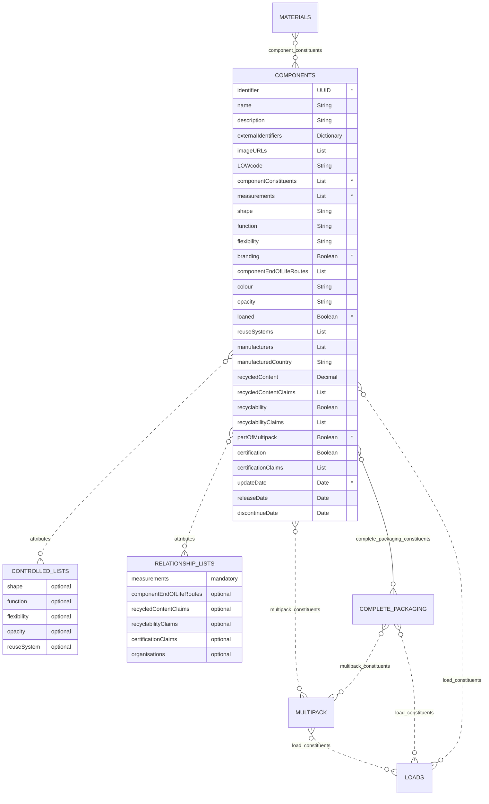
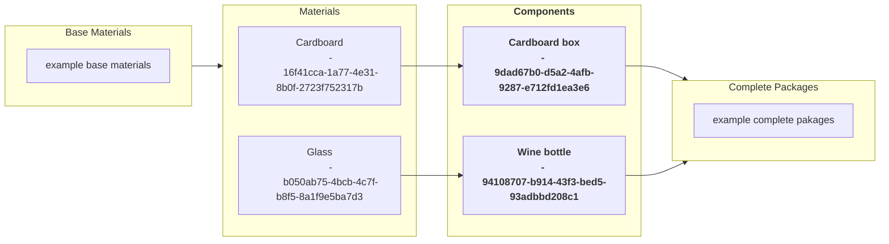

# Components

The components schema contains information regarding the individual components that are used to create complete packages. These maybe created from a single material or a combination of materials from the materials schema.

## Table
|Column|<div style="width:90px">Status</div>|Format|Notes|
|:-|:-|:-|:-|
|identifier|`mandatory`|UUID|A globally unique identifier. See [identifiers](../4_Identifiers/4_1_Identifiers.md) section for information on how to construct this identifier|
|name|`optional`|String|The name of this component.|
|description|`optional`|String|A brief description of this component.|
|externalIdentifiers|`optional`|Dictionary|A dictionary of identifiers that might be used to identify the component in other systems. For example: manufacturer's own internal identifier, bar codes or global trade item number (gtin). To provide external identifiers please follow this format. `{'externalIdentifierName1': 'identifier1', 'externalIdentifierName2': 'identifier2'}`|
|imageURLs|`optional`|List|A list of URLs that links to a picture of the component. Please see the guidelines below on how to capture the image and name the URL.|
|LOWcode|`optional`|String|The list of waste code for **only** the component, by itself. LOW code is synonymous with European Waste Catalogue Code (EWC). For example: an empty bottle would have a LOWcode of `15 01 02`. Please use [Dsposal](https://dsposal.uk/browse/ewc) or [legislation.gov](https://www.legislation.gov.uk/uksi/2005/895/schedule/1/made) to find the LOWcode. **Note**: The LOWcode can based on its combination with other components and the actual product contained in the completePackaging. Be sure to only include the component LOWcode. If you cannot find the code or are uncertain please enter `Uncertain`.|
|componentConstituents|`mandatory`|List|The information regarding the consituents that are combined to create this component. The entries should be from the [Component Constituents Relationship List](../6_Relationship_Lists/6_002_Component_Constituents.md) identifier.|
|measurements fontawesome-solid-square-plus:{ title="Added to this version" .addition }|`mandatory`|List|The information regarding the measurements of the component. The entries should be from the [Measurements Relationship List](../6_Relationship_Lists/6_012_Measurements.md).|
|shape|`optional`|String|What is the shape of the component? The entry should contain the [shape controlled list](../5_Controlled_Lists/5_006_Shape.md) identifier for the component.|
|function|`optional`|String|What is the function of the component? The entry should contain the [function controlled list](../5_Controlled_Lists/5_004_Function.md) identifier for the component.|
|flexibility|`optional`|String|Whether the component is considered flexible or rigid. The entry should be the [flexibility controlled list](../5_Controlled_Lists/5_007_Flexibility.md) identifier.|
|branding|`mandatory`|Boolean|Does the component contain your own brand (logo, trademark, or any distinctive mark)? Answer as: `TRUE` for yes and `FALSE` for no.|
|componentEndOfLifeRoutes|`optional`|List|The information regarding this component's proposed end of life routes. The entries should be the [component end of life routes](../6_Relationship_Lists/6_007_Component_End_of_Life_Routes.md) identifiers.|
|colour|`optional`|String|The actual colour of the component at point of production using CMYK (Cyan-Magenta-Yellow-blacK) values. The format is specified according to cmyk(C%, M%, Y%, K%), where C, M, Y, and K are the percent values for the cyan, magenta, yellow, and black values of the color. For example: black is `cmyk(0%,0%,0%,100%)`. If there are multiple colours input `decorative`.|
|opacity|`optional`|String|The transparency of the colours. The entry should be the [opacity controlled list](../5_Controlled_Lists/5_009_Opacity.md) identifier.|
|loaned|`mandatory`|Boolean|Is the component hired or loaned out as reusable packaging? Answer as: `TRUE` for yes and `FALSE` for no.|
|reuseSystems|`optional`|List|The system(s) that facilitates the reuse of the component  `e.g., The Reuse Standand, PR3 standards`. The entries should be the [reuse system controlled list](../5_Controlled_Lists/5_010_Reuse_System.md) identifier(s).|
|partOfMultipack|`mandatory`|Boolean|Is the component part of a multipack? Answer as: `TRUE` for yes and `FALSE` for no.|
|recycledContent|`optional`|Decimal|Positive decimal only, maximum value is 100.00. Value should equated to a percentage (e.g. 30 = 30%) The minimum allowable percent of how much recycled content is included in the makeup of the component. It is 'mandatory' for plastic packaging where for the purposes of this standard we refer to [UK's HM Revenue & Customs](https://www.gov.uk/guidance/work-out-which-packaging-is-subject-to-plastic-packaging-tax){target=_blank} definition of recycled content. "Recycled plastic is plastic that has been reprocessed from recovered material by using a chemical or manufacturing process. This is so it can be used either for its original purpose or for other purposes. This does not include organic recycling. Recovered material is pre-consumer plastic or post-consumer plastic that both: a) is no longer suitable to be used in the process from which it was generated and would otherwise have been used for energy recovery (for example, by incineration) or disposed of as waste (for example, by being sent to landfill); b) has been collected and recovered for use as a material input for a recycling or manufacturing process, instead of new primary material"|
|recycledContentClaims|`optional`|List|The information regarding the recycled contents. The entries should be the [recycled content claims relationship list](../6_Relationship_Lists/6_009_Recycled_Content_Claims.md) indentifiers.|
|recyclability|`optional`|Boolean|Is the component recyclable (as determined by a reputable source)? Answer as: `TRUE` for yes and `FALSE` for no.|
|recyclabilityClaims|`optional`|List|The information regarding this recyclability claims. The entries should be the [recyclability claims relationship list](../6_Relationship_Lists/6_006_Recyclability_Claims.md) identifiers.|
|certification|`optional`|Boolean|Does the component have a certificate (e.g. FSC, REACH, FSA etc.)? Answer as: `TRUE` for yes and `FALSE` for no.|
|certificationClaims|`optional`|List|The information regarding the certifications. The entries should be the [certification claims relationship list](../6_Relationship_Lists/6_005_Certification_Claims.md) identifiers.|
|manufacturers|`optional`|List|The information regarding the manufacturer(s). The entries should be the [Organisations Relationship List](../6_Relationship_Lists/6_010_Organisations.md) identifiers.|
|manufacturedCountry|`optional`|String|The country the component was manufactured in. Use the country numeric [ISO codes](https://www.iso.org/obp/ui/#search){target=_blank} as described in the [ISO 3166 international standard](https://www.iso.org/iso-3166-country-codes.html){target=_blank}.|
|updateDate|`mandatory`|Date|The date that the component was provided/last updated. Use the format `yyyy-mm-dd` adhering to the [ISO 8601 dateTime standard](https://www.iso.org/iso-8601-date-and-time-format.html).|
|releaseDate|`optional`|Date|The date that the component will be available to use. Use the format `yyyy-mm-dd` adhering to the [ISO 8601 dateTime standard](https://www.iso.org/iso-8601-date-and-time-format.html).|
|discontinueDate|`optional`|Date|The date that the component will no longer be available to use. Use the format `yyyy-mm-dd` adhering to the [ISO 8601 dateTime standard](https://www.iso.org/iso-8601-date-and-time-format.html).|

## Diagram



## Example

=== "Cardboard box - JSON"

    ``` json linenums="1"  hl_lines="3 4"
    [
        {
            "identifier": "9dad67b0-d5a2-4afb-9287-e712fd1ea3e6",
            "name": "Cardboard box",
            "description": "54cm x 38cm x 38cm 0204 style cardboard box: Sturdy and spacious for shipping or storage. All flaps meet for easy sealing. Versatile packaging solution for various items.",
            "componentConstituents": [
                {
                "materialConstituentsIdentifier": "6d856739-3893-4321-84b9-738a4ef1c830",
                "materialCombinationIdentifier": "16f41cca-1a77-4e31-8b0f-2723f752317b"
                }
            ],
            "measurements": [
                "8c7a71e1-899c-4932-b4e7-1492a7dc6083"
            ],
            "shape": "c-shape-0004",
            "function": "function-0048",
            "flexibility": "c-flexibility-0002",
            "branding": false,
            "componentEndOfLifeRoutes": [
                "671ee5cc-a402-48a5-ba56-1f4d3840aef0"
            ],
            "colour": "cmyk(0%,14%,33%,18%)",
            "opacity": "c-opacity-0001",
            "loaned": false,
            "partOfMultipack": false,
            "recycledContent": 30,
            "recycledContentClaims": [
                "81ac4ec3-e097-4092-9c8f-4ef717d3740c"
            ],
            "recyclability": true,
            "recyclabilityClaims": [
                "6af9c69a-6ec1-42dd-a8da-54bab8165e44"
            ],
            "certification": false,
            "manufacturers": ["GB-COH-10906273"],
            "manufacturedCountry": "826",
            "updateDate": "2024-01-25",
            "releaseDate": "2011-01-01"
        }
    ]
    ```
=== "Wine bottle - JSON"

    ``` json linenums="1"  hl_lines="3 4"
    [
        {
            "identifier": "94108707-b914-43f3-bed5-93adbbd208c1",
            "name": "Wine bottle",
            "description": "Introducing our 750ml Bordeaux Bottle, a sophisticated and eco-conscious choice for wine packaging. Crafted with a commitment to sustainability, this bottle embodies the perfect blend of elegance and environmental responsibility.",
            "externalIdentifiers": {
                "gtin": "70123456 789012",
                "internal id": "0-recycle-green-750-bordeaux",
                "sku": "8855-bb-g"
            },
            "imageURLs" : ["https://dsposal.uk/media/35604/52419bc2-317f-4815-b39c-f90a20cb7a7a.jpg"],
            "componentConstituents": [
            {
              "materialConstituentsIdentifier": "70023f95-2d0f-4e47-ab6e-0ce51d50e55d",
              "materialCombinationIdentifier": "b050ab75-4bcb-4c7f-b8f5-8a1f9e5ba7d3"
            }
            ],
            "measurements": [
                "e83b250b-8fd5-472f-82d1-049b0c4e9ca9"
            ],
            "function": "function-0005",
            "flexibility": "c-flexibility-0002",
            "branding": false,
            "componentEndOfLifeRoutes": [
                "e2aaabed-f901-4bbe-87e6-c781de2fb569"
            ],
            "colour": "cmyk(90%,30%,100%,20%)",
            "opacity": "c-opacity-0002",
            "loaned": false,
            "partOfMultipack": false,
            "recycledContent": 70,
            "recycledContentClaims": [
                "defd2813-0987-486a-8698-e8257b5ece63"
            ],
            "recyclability": true,
            "recyclabilityClaims": [
                "79290e8d-bd0e-4fcc-aa22-b932df206c49"
            ],
            "certification": true,
            "certificationClaims": [
                "79290e8d-bd0e-4fcc-aa22-b932df206c49"
            ],
            "manufacturers": ["GB-COH-10906273"],
            "manufacturedCountry": "826",
            "updateDate": "2023-12-07",
            "releaseDate": "2015-06-16"
        }
    ]
    ```
=== "Cardboard box - XML"

    ``` xml linenums="1"  hl_lines="3 4"
    <?xml version="1.0" encoding="UTF-8" ?>
    <component>
        <identifier>9dad67b0-d5a2-4afb-9287-e712fd1ea3e6</identifier>
        <name>Cardboard box</name>
        <description>54cm x 38cm x 38cm 0204 style cardboard box: Sturdy and spacious for shipping or storage. All flaps meet for easy sealing. Versatile packaging solution for various items.</description>
        <componentConstituents>
        <materialConstituentsIdentifier>6d856739-3893-4321-84b9-738a4ef1c830</materialConstituentsIdentifier>
        <materialCombinationIdentifier>16f41cca-1a77-4e31-8b0f-2723f752317b</materialCombinationIdentifier>
        </componentConstituents>
        <measurements>8c7a71e1-899c-4932-b4e7-1492a7dc6083</measurements>
        <shape>c-shape-0004</shape>
        <function>function-0048</function>
        <flexibility>c-flexibility-0002</flexibility>
        <branding>false</branding>
        <componentEndOfLifeRoutes>671ee5cc-a402-48a5-ba56-1f4d3840aef0</componentEndOfLifeRoutes>
        <colour>cmyk(0%,14%,33%,18%)</colour>
        <opacity>c-opacity-0001</opacity>
        <loaned>false</loaned>
        <partOfMultipack>false</partOfMultipack>
        <recycledContent>30</recycledContent>
        <recycledContentClaims>81ac4ec3-e097-4092-9c8f-4ef717d3740c</recycledContentClaims>
        <recyclability>true</recyclability>
        <recyclabilityClaims>6af9c69a-6ec1-42dd-a8da-54bab8165e44</recyclabilityClaims>
        <certification>false</certification>
        <manufacturers>GB-COH-10906273</manufacturers>
        <manufacturedCountry>826</manufacturedCountry>
        <updateDate>2024-01-25</updateDate>
        <releaseDate>2011-01-01</releaseDate>
    </component>
    ```
=== "Wine bottle - XML"

    ``` xml linenums="1"  hl_lines="3 4"
    <?xml version="1.0" encoding="UTF-8" ?>
    <component>
        <identifier>94108707-b914-43f3-bed5-93adbbd208c1</identifier>
        <name>Wine bottle</name>
        <description>Introducing our 750ml Bordeaux Bottle, a sophisticated and eco-conscious choice for wine packaging. Crafted with a commitment to sustainability, this bottle embodies the perfect blend of elegance and environmental responsibility.</description>
        <externalIdentifiers>
        <gtin>70123456 789012</gtin>
        <sku>8855-bb-g</sku>
        <internal_id>0-recycle-green-750-bordeaux</internal_id>
        </externalIdentifiers>
        <imageURLs>https://dsposal.uk/media/35604/52419bc2-317f-4815-b39c-f90a20cb7a7a.jpg</imageURLs>
        <componentConstituents>
        <materialConstituentsIdentifier>70023f95-2d0f-4e47-ab6e-0ce51d50e55d</materialConstituentsIdentifier>
        <materialCombinationIdentifier>b050ab75-4bcb-4c7f-b8f5-8a1f9e5ba7d3</materialCombinationIdentifier>
        </componentConstituents>
        <measurements>671ee5cc-a402-48a5-ba56-1f4d3840aef0</measurements>
        <function>function-0005</function>
        <flexibility>c-flexibility-0002</flexibility>
        <branding>false</branding>
        <componentEndOfLifeRoutes>e2aaabed-f901-4bbe-87e6-c781de2fb569</componentEndOfLifeRoutes>
        <colour>cmyk(90%,30%,100%,20%)</colour>
        <opacity>c-opacity-0002</opacity>
        <loaned>false</loaned>
        <partOfMultipack>false</partOfMultipack>
        <recycledContent>70</recycledContent>
        <recycledContentClaims>defd2813-0987-486a-8698-e8257b5ece63</recycledContentClaims>
        <recyclability>true</recyclability>
        <recyclabilityClaims>79290e8d-bd0e-4fcc-aa22-b932df206c49</recyclabilityClaims>
        <certification>true</certification>
        <certificationClaims>79290e8d-bd0e-4fcc-aa22-b932df206c49</certificationClaims>
        <manufacturers>GB-COH-10906273</manufacturers>
        <manufacturedCountry>826</manufacturedCountry>
        <updateDate>2023-12-07</updateDate>
        <releaseDate>2015-06-16</releaseDate>
    </component>
    ```

## Data flow



## Guide for component images
As with providing measurements, please first find the default front of the component. The image capturing process and naming convention is similar to [GS1](https://www.gs1.org/standards/gs1-product-image-specification-standard/current-standard#1-Introduction){target=_blank}. As with measurements, we altered the gs1 standard for capturing the component.

### Type of Image
For the purposes of this standard, we define the differences between photographic and rendered images. Note: both types are accepted but the naming convention will differ based on image type so that images have unique names and do not having naming conflicts.

- **Photographic image**: the result of the electronic or chemical capture of a likeness of a physical object with the use of a camera.
- **Rendered image**: the result of the creation of a digital likeness of a physical object with the use of a computer and software.

### Image Recommendations
- Provide coloured images. However, do not provide colour casts. Colour should be as rich, vibrant and eye-catching as possible
- Contrast and exposure should be balanced; avoid high contrast effects and "blown-out" highlights
- Images should not be overly sharpened
- Components should be centred in Margins to cover 95% on the canvas.
- Graphic rendering of a component should be realistic.
- Do not provide layers, guides or rulers in the images.
- Background layer should be white (RGB 255,255,255).
- Remove signatures, "finger printing" or visible watermarks. No compression artifacts. No interpolation ("resizing up").

### File size
- 900x900 to 2400x2400 pixels

### Component faces
After determining the default front, the possible faces, in relation to the default front, are:
1. Default Front
2. Left
3. Top
7. Back
8. Right
9. Bottom

### Naming convention for URL
Please follow this naming convention: 
- component identifier
- underscore `_`
- type of image (`photographic` or `rendered`)
- underscore `_`
- component face (`1`: Default front, `2`: Left, `3`: Top, `7`: Back, `8`: Right, `9`: Bottom)
- orientation (`C`: Centre, `L`: left, `R`: right, `N`: No plunge angle)

**Example**: An image for a component that is rendered with a default front facing image and centred orientation. `identifier123_rendered_1C.jpg`


