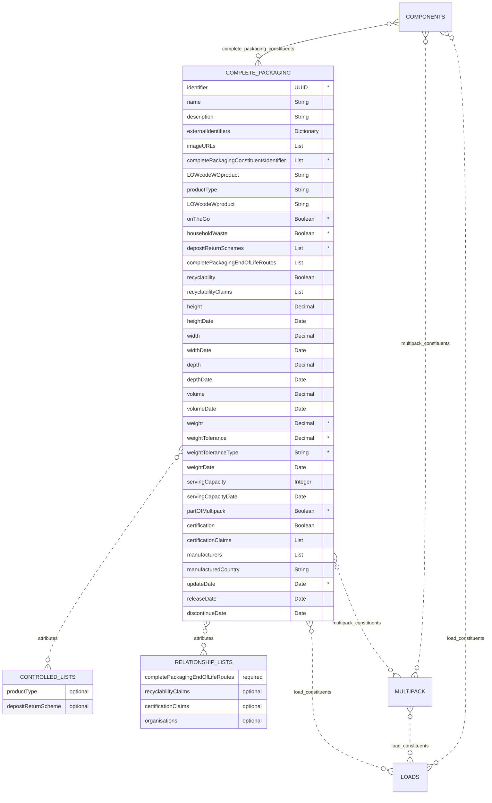

# Complete Packaging

The complete packaging schema contains information regarding the complete packages that are used to create loads. These maybe created from a single component or a combination of components from the components schema.

## Table
|Column|<div style="width:90px">Status</div>|Format|Notes|
|:-|:-|:-|:-|
|identifier|`mandatory`|UUID|A globally unique identifier. See [identifiers](../4_Identifiers/4_1_Identifiers.md) section for information on how to construct this identifier|
|name|`optional`|String|The name of this complete packaging.|
|description|`optional`|String|A brief description of this complete packaging.|
|externalIdentifiers|`optional`|Dictionary|A dictionary of identifiers that might be used to identify the complete packaging in other systems. For example: manufacturer's own internal identifier, bar codes or global trade item number (gtin). To provide external identifiers please follow this format. `{'externalIdentifierName1': 'identifier1', 'externalIdentifierName2': 'identifier2'}`|
|imageURLs|`optional`|List|URL(s) that links to a picture of the complete packaging. Please see the guidelines below on how to capture the image and name the URL.|
|completePackagingConstituentsIdentifier|`mandatory`|List|The information regarding the consituents that are combined to create this complete packaging. The entries should be from the [Complete Packaging Constituents Relationship List](../6_Relationship_Lists/6_003_Complete_Packaging_Constituents.md) identifier.|
|LOWcodeWOproduct|`optional`|String|The list of waste code for **only** the complete packaging, by itself (excluding the product). LOW code is synonymous with European Waste Catalogue Code (EWC). For example: an empty bottle would have a LOWcode of `15 01 02`. Please use [Dsposal](https://dsposal.uk/browse/ewc){target=_blank} or [legislation.gov](https://www.legislation.gov.uk/uksi/2005/895/schedule/1/made){target=_blank} to find the LOWcode. **Note**: The LOWcode can based on its combination with other components and the actual product contained in the complete packaging. Be sure to only include the complete packaging LOWcode and not the complete packaging with the product. If you cannot find the code or are uncertain please enter `Uncertain`.|
|productType|`optional`|String|Information about the product contained in the complete packaging. The entry here should be drawn from the [product type controlled list](../5_Controlled_Lists/5_012_Product_Type.md).|
|LOWcodeWproduct|`optional`|String|The list of waste code for **everything** in the complete packaging. LOW code is synonymous with European Waste Catalogue Code (EWC). For example: an empty bottle would have a LOWcode of `15 01 02`. Please use [Dsposal](https://dsposal.uk/browse/ewc){target=_blank} or [legislation.gov](https://www.legislation.gov.uk/uksi/2005/895/schedule/1/made){target=_blank} to find the LOWcode. **Note**: The LOWcode can based on its combination with other components and the actual product contained in the complete packaging. Be sure to include the complete packaging LOWcode with the product. If you cannot find the code or are uncertain please enter `Uncertain`.|
|onTheGo|`mandatory`|Boolean|Is the complete packaging often classed as packaging that will end up in street bins? Answer as: `TRUE` for yes and `FALSE` for no.|
|householdWaste|`mandatory`|Boolean|Is the complete packaging often classed as packaging that will end up in kerbside collections? Answer as: `TRUE` for yes and `FALSE` for no.|
|depositReturnSchemes|`mandatory`|List|Which countries support a deposit return scheme for this particular complete packaging? The entries here should be drawn from the [deposit return scheme controlled list](../5_Controlled_Lists/5_013_Deposit_Return_Scheme.md).|
|completePackagingEndOfLifeRoutes|`optional`|List|The information regarding this complete packaging's proposed end of life routes. The entries should be the [complete packaging end of life routes](../6_Relationship_Lists/6_008_Complete_Packaging_End_of_Life_Routes.md) identifiers.|
|recyclability|`optional`|Boolean|Is the complete packaging recyclable (as determined by a reputable source)? Answer as: `TRUE` for yes and `FALSE` for no.|
|recyclabilityClaims|`optional`|List|The information regarding this recyclability claims. The entries should be the [recyclability claims relationship list](../6_Relationship_Lists/6_006_Recyclability_Claims.md) identifiers.|
|height|`optional`|Decimal|The height of the complete packaging. Please see the guidelines below on how to properly measure and report the height.|
|heightDate|`optional`|Date|The date that the height was last verified/measured. Use the format `yyyy-mm-dd` adhering to the [ISO 8601 dateTime standard](https://www.iso.org/iso-8601-date-and-time-format.html).|
|width|`optional`|Decimal|The width of the complete packaging. Please see the guidelines below on how to properly measure and report the width.|
|widthDate|`optional`|Date|The date that the width was last verified/measured. Use the format `yyyy-mm-dd` adhering to the [ISO 8601 dateTime standard](https://www.iso.org/iso-8601-date-and-time-format.html).|
|depth|`optional`|Decimal|The depth of the complete packaging. Please see the guidelines below on how to properly measure and report the depth.|
|depthDate|`optional`|Date|The date that the depth was last verified/measured. Use the format `yyyy-mm-dd` adhering to the [ISO 8601 dateTime standard](https://www.iso.org/iso-8601-date-and-time-format.html).|
|volume|`optional`|Decimal|Using the height, width, and depth found using the measurement guidelines, calculate the complete packaging's volume using: `height x width x depth`.|
|volumeDate|`optional`|Date|The date that the volume was last verified/measured. Use the format `yyyy-mm-dd` adhering to the [ISO 8601 dateTime standard](https://www.iso.org/iso-8601-date-and-time-format.html).|
|weight|`mandatory`|Decimal|The weight of the complete packaging.|
|weightTolerance|`mandatory`|Decimal|The threshold of weight that complete packaging can vary by. This can be given in grams or percentage.|
|weightToleranceType|`mandatory`|String|Either `grams` or `percentage` based on the value provided in `weightTolerance`|
|weightDate|`optional`|Date|The date that the weight was last verified/measured. Use the format `yyyy-mm-dd` adhering to the [ISO 8601 dateTime standard](https://www.iso.org/iso-8601-date-and-time-format.html).|
|servingCapacity|`optional`|Integer|The serving capacity of the complete packaging - how much of a product that can be contained in the complete packaging.|
|servingCapacityDate|`optional`|Date|The date that the serving capacity was last verified/measured. Use the format `yyyy-mm-dd` adhering to the [ISO 8601 dateTime standard](https://www.iso.org/iso-8601-date-and-time-format.html).|
|partOfMultipack|`mandatory`|Boolean|Is the complete packaging part of a multipack? Answer as: `TRUE` for yes and `FALSE` for no.|
|certification|`optional`|Boolean|Does the complete packaging have a certificate (e.g. FSC, REACH, FSA etc.)? Answer as: `TRUE` for yes and `FALSE` for no.|
|certificationClaims|`optional`|List|The information regarding the certifications. The entries should be the [certification claims relationship list](../6_Relationship_Lists/6_005_Certification_Claims.md) identifiers.|
|manufacturers|`optional`|List|The information regarding the manufacturer(s). The entries should be the [Organisations Relationship List](../6_Relationship_Lists/6_010_Organisations.md) identifiers.|
|manufacturedCountry|`optional`|String|The country the component was manufactured in. Use the country numeric [ISO codes](https://www.iso.org/obp/ui/#search){target=_blank} as described in the [ISO 3166 international standard](https://www.iso.org/iso-3166-country-codes.html){target=_blank}.|
|updateDate|`mandatory`|Date|The date that the complete packaging was provided/last updated. Use the format `yyyy-mm-dd` adhering to the [ISO 8601 dateTime standard](https://www.iso.org/iso-8601-date-and-time-format.html).|
|releaseDate|`optional`|Date|The date that the complete packaging will be available to use. Use the format `yyyy-mm-dd` adhering to the [ISO 8601 dateTime standard](https://www.iso.org/iso-8601-date-and-time-format.html).|
|discontinueDate|`optional`|Date|The date that the complete packaging will no longer be available to use. Use the format `yyyy-mm-dd` adhering to the [ISO 8601 dateTime standard](https://www.iso.org/iso-8601-date-and-time-format.html).|

## Diagram



## Template

Complete packaging should be provided as a separate csv file. The specification of this csv file is as follows:

[Complete Packaging Template](https://www.open3p.org/wp-content/uploads/2023/09/completePackaging20230922.csv){target=_blank}

## Example

=== "JSON"

    ``` json linenums="1"
    {
        "identifier": "63df4b40-ba4f-472e-a260-f8a944eb7961",
        "name": "4 Breaded Chicken Steaks packaging",
        "description": "PET tray, lidding film, top & base label",
        "externalIdentifiers": {
            "internalIdentifer": "85467889",
            "GTIN": "00123456789012"
            },
        "imageURLs": [
            "http://standard.open3p.org/2.0/img/measurements/figure1.measuring.png"
        ],
        "completePackagingConstituentsIdentifier": [
            "9F459508-E365-0B9F-E3BB-FF4A7AED481B", "7197de37-8b77-4032-b0fd-84f27bae97be", "0e9a7265-6213-4a76-9a45-3acc5d83fa6f", "1c042eee-ec7a-400b-b05b-ca0d319e9067"
        ],
        "LOWcodeWOproduct": "15 01 06",
        "productType": "cp-product-type-0001",
        "LOWcodeWproduct": "20 01 08",
        "onTheGo": false,
        "householdWaste": true,
        "depositReturnSchemes": [
            "cp-drs-0005"
        ],
        "completePackagingEndOfLifeRoutes": [
            "1229f395-3065-4236-bc1e-2aa500f58a79"
        ],
        "recyclability": false,
        "recyclabilityClaims": [
            "b101889f-87e5-4c42-abb7-0df5fc3d1a26"
        ],
        "height": 220,
        "heightDate": "2023-01-01",
        "width": 170,
        "widthDate": "2023-01-01",
        "depth": 60,
        "depthDate": "2023-01-01",
        "volume": 0.002,
        "volumeDate": "2023-01-01",
        "weight": 32.8,
        "weightTolerance": 5,
        "weightToleranceType": "percentage",
        "weightDate": "2023-01-01",
        "servingCapacity": 4,
        "servingCapacityDate": "2023-01-01",
        "partOfMultipack": false,
        "certification": true,
        "certificationClaims": [
            "eed87ac3-6e3e-45fb-af2c-dd0f64fdb597"
        ],
        "manufacturers": [""],
        "manufacturedCountry": "826",
        "updateDate": "2023-01-01",
        "releaseDate": "2023-01-01",
        "discontinueDate": ""
    }
    ```
=== "CSV download"

    * [Complete Packaging example download](https://www.opendatamanchester.org.uk/wp-content/uploads/2023/01/7_1_3_Complete_Packaging_Example.csv){target=_blank}

## Guide for how to take measurements

### Units

All measurements should be given using the metric system.

- Height: millimetre (mm)
- Width: millimetre (mm)
- Length: millimetre (mm)
- Volume: cubic metre (m3)
- Weight: grams (g)
- servingCapacity: grams (g)

Numbers should be entered with a decimal place, a space between the number, and the unit as specified above. Use the decimal / full stop / period character as a separator. For example: volume = 20.000 mm3. Do not exceed 3 decimal places.

**Important**: When converting between systems of measurement, perform the conversion first and then apply rounding. This will give more accuracy and consistency.

### Default Front of a complete packaging
As with taking and reporting measurements for components, we use the [GS1](https://www.gs1.org/){target=_blank} method for taking measurements. Now, with all the components put together to form the complete packaging, first find the default front, the the face with the largest area, where area is equal to the width times the height.

- The side with the maximum area then becomes the default front of that complete packaging.

### Measuring the height, width, and depth of a complete packaging
After the default front has been determined, it is possible to determine the height, width, and depth of the complete packaging. Please follow the measurement guidelines provided by [GS1](https://www.gs1.org/standards/gs1-package-and-product-measurement-standard/current-standard#4-Consumer-(end-user)-trade-items+4-3-Determining-the-height,-width-and-depth){target=_blank}


## Guide for complete packaging images
As with providing measurements, please first find the default front of the complete packaging. The image capturing process and naming convention is similar to [GS1](https://www.gs1.org/standards/gs1-product-image-specification-standard/current-standard#1-Introduction){target=_blank}. 
