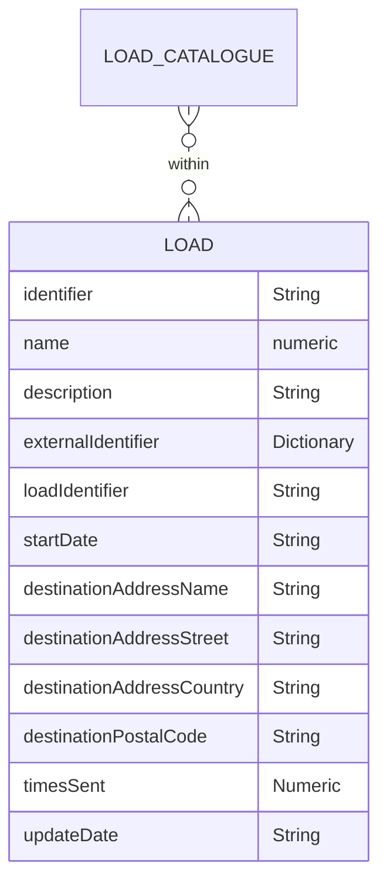

# Load

All the complete packaging from different levels (primary, secondary, and tertiary), including multipacks, put together to send to the final destination. Each row corresponds a unique complete packaging (or multipack) item sent to a specific location during a specific time period.

## Table
|Column|<div style="width:90px">Status</div>|Format|Notes|
|:-|:-|:-|:-|
|identifier|`required`|String|A globally unique identifier. See identifiers section for information on how to construct this identifier|
|name|`recommended`|String|The name of this load.|
|description|`recommended`|String|A brief description of this load.|
|externalIdentifier|`recommended`|Dictionary|A dictionary of identifiers that might be used to identify the component in other systems. For example: manufacturer's own internal identifier, bar codes or global trade item number (gtin). To provide external identifiers please follow this format. `{'tagName1': 'identifier1', 'tagName2': 'identifier2'}`|
|loadIdentifier|`required`|String|The unique identifier of the created load. There must be an equivalent identifier found in the `load catalogue`.|
|startDate|`required`|String|The date that the load began for the destination. Use the format `dd/mm/yyyy`.|
|endDate|`required`|String|The date that the load ended for the destination. Use the format `dd/mm/yyyy`.|
|destinationAddressName|`recommended`|String|The name of the load destination address.|
|destinationAddressStreet|`required`|String|The street address of this load destination.|
|destinationAddressCountry|`required`|String|The country of this load destination.|
|destinationPostalCode|`required`|String|The postal code of this load destination.|
|timesSent|`required`|Numeric|The number of times this load was sent to the destination during the specified time period.|
|updateDate|`required`|String|The date that the load was provided/last updated. Use the format `dd/mm/yyyy`.|

## Diagram



<!-- <figure markdown>
[{ width="450" }](https://opendatamanchester.github.io/PPP/img/load-v1.0.0-22-12-20.png){target=_blank}
  <figcaption>Data schema</figcaption>
</figure> -->

## Template

Loads should be provided as a separate csv file, in tidy format. This means that each row of the csv file should be a single load or a multi loads from the load catagolue schema. An example is provided.

The specification of this csv file is as follows:

[Load_Template.csv](https://www.opendatamanchester.org.uk/wp-content/uploads/2023/01/7_1_6_Load_Template.csv){target=_blank}

## Example

=== "JSON"

    ``` json linenums="1"
    {
      "identifier": "ED051AFD-EC7F-0428-B054-8837118922FE",
      "name": "Weekly Load of Guacamole Dip",
      "description": "24 cases of 12 tubs of guacamole dip for example company on high street west",
      "externalIdentifiers": {
        "GTIN":"00123456789012",
        },
      "loadIdentifier": "CA88F5CE-2D09-AFE0-08D7-44804780F924",
      "startDate": "01/08/2022",
      "endDate": "01/08/2022",
      "destinationAddressName": "Example Company",
      "destinationAddressStreet": "High Street West",
      "destinationAddressCountry": "England",
      "destinationPostalCode": "XX00 0XX",
      "timesSent": "2",
      "updateDate": "01/08/2022",
    }
    ```
=== "CSV download"

    * [Load example download](https://www.opendatamanchester.org.uk/wp-content/uploads/2023/01/7_1_6_Load_Example.csv){target=_blank}
    